来了解一下照片是怎么来的。

<!-- more -->

这篇文章主要还是参考了阮一峰的《为什么数码相机可以拍出彩色照片？》，主要是写个笔记方便自己查看，推荐看原文。

# 照片的起源

其实并没有找全历史，时间线好像并不明确，大概了解一下吧。

## 一、第一张照片？

1825年，法国人[涅普斯](https://zh.wikipedia.org/wiki/約瑟夫·尼塞福爾·涅普斯)（Joseph Nicéphore Nièpce），用感光的方式复制了一个17世纪的荷兰版画——牵马人，这是最早的可保存感光影像。

他原本对做石版画非常感兴趣，但是因为在石板上雕刻画面实在是太累了，他就想试试看能不能找到让光帮他自动画画的方法。结果发现了沥青在感光之后会硬化，然后把涂抹了沥青的载体放入溶液中之后，溶解掉因为感光硬化以外的部分，图像就显现出来了。

实验出了这个结果，他就想赶快把这个沥青的锡板做出来放在暗箱内拍一张试试，结果因为失误放在自家窗前曝光了 8 个小时，就这样，一张可保存的照片，就阴差阳错的诞生了，名叫《窗外的风景》，这幅作品被很多文献认作人类最早的的照片。从 1826 年保存至今，现在原版被被保存在美国德克萨斯大学奥斯汀分校。

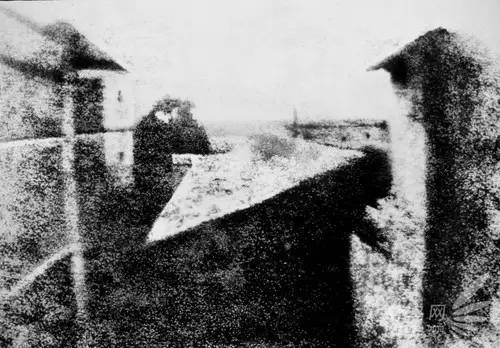

## 二、黑白照片？

那黑白照片呢？好像没有找到完整的发展历史，但是查阅资料，有资料说黑白照片是使用[氯化银](https://zh.wikipedia.org/wiki/氯化银)（silver chloride）作为感光剂。当光线照射氯化银，后者会分解成纯银和氯气，银金属颗粒呈现黑色。因此，底片颜色越深代表光线越强，颜色越浅代表光线越弱，黑白照片就是这样拍出来。

## 三、胶片？

**胶片**（Film）是一种用于记录图像的成像介质，也是一种摄影耗材。胶片又称菲林（英文音译），包装好的在盒中的胶片又称为胶卷。常见的胶片通常由一侧涂覆含微小光敏[卤化银](https://zh.wikipedia.org/wiki/卤化银)晶体的明胶[乳剂](https://zh.wikipedia.org/w/index.php?title=摄影乳剂&action=edit&redlink=1)的条状或片状透明薄膜[片基](https://zh.wikipedia.org/w/index.php?title=片基_(摄影)&action=edit&redlink=1)构成。卤化银晶体的大小和其他特性决定了胶片的[感光度](https://zh.wikipedia.org/wiki/感光度)、对比度和[分辨率](https://zh.wikipedia.org/wiki/分辨率)[[1]](https://zh.wikipedia.org/wiki/底片#cite_note-1)。

当暴露在光线下时，胶片所含有卤化银中的银离子会逐渐还原为金属银，乳剂因而逐渐变黑。不过若没有外界条件的干预，过程将极其缓慢且不完整，因而该方法没得到实际应用。取而代之的是对镜头成像的极短时间[曝光](https://zh.wikipedia.org/wiki/曝光)，可以产生与每个晶体所吸收的光量成比例的极轻微化学变化，并在乳剂中产生不可见的[潜像](https://zh.wikipedia.org/w/index.php?title=潜像&action=edit&redlink=1)，化学[显影](https://zh.wikipedia.org/wiki/沖洗)之后即可成为可见的图像[[2]](https://zh.wikipedia.org/wiki/底片#cite_note-2)。

黑白胶片通常只含有一层感光层。曝光后的卤化银晶体显影时，[银离子](https://zh.wikipedia.org/wiki/离子)被还原为金属银，阻挡光线而表现为负片胶片中的黑色部分。彩色胶片至少含有三层感光层，并结合了不同组合的[增感染料](https://zh.wikipedia.org/w/index.php?title=增感染料&action=edit&redlink=1)。通常，蓝光感光层位于最上方，随后是黄色滤光层，以阻止任何剩余蓝光影响随后的感光层，其下分别是绿光-蓝光感光层和红光-蓝光感光层，分别记录绿色和蓝色图像。在显影过程中，就像黑白胶片一样，银离子被还原为金属银。但显影过程中的副产品同时也与胶片或显影液中的[彩色耦合剂](https://zh.wikipedia.org/w/index.php?title=彩色耦合剂&action=edit&redlink=1)结合，形成彩色染料。由于显影副产品的产生量与曝光和显影的量成正比，因此形成的彩色染料也与曝光和显影的量成正比。显影后，金属银经过漂白步骤重新转化为卤化银，并在定影步骤中给除去。定影步骤后，胶片上只留下形成的彩色染料，组合在一起即构成可见的彩色图像。

## 四、彩色照片产生

19世纪中期，人们发现，人眼的圆锥细胞对三种颜色：红、绿、蓝特别敏感。伟大的英国物理学家麦克斯韦因此假设，红绿蓝作为基色，可以拍出彩色照片。

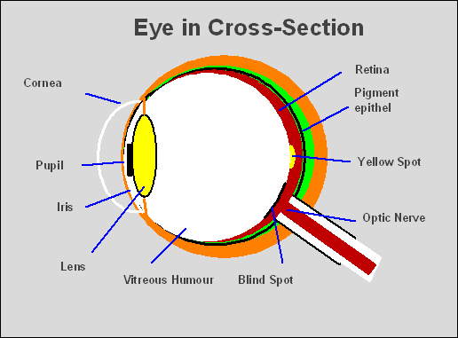

1861年，在麦克斯韦的指导下，人类的第一张彩色照片诞生了。采用的方法是在镜头前，分别用红丝带、绿丝带、蓝丝带过滤光线，曝光形成三张底片，然后用三部放映机向同一处投影这三张底片，每部放映机的镜头前都拧上对应颜色的镜头，它们的合成效果就是一张彩照。

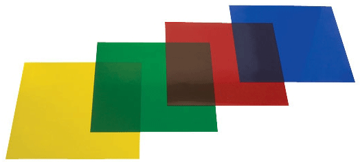

而真正意义上的彩色胶卷，1933年诞生于柯达公司，底片之上依次有三个感光层，分别对红、绿、蓝三种颜色进行曝光，最后叠加形成一张彩色底片。

## 五、图像传感器的诞生

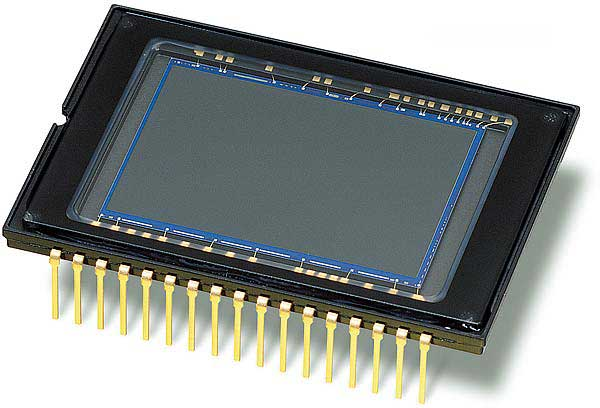

二战后，计算机诞生，科学家发现图像可以用数字形式表示。如果将光信号转变成电信号，就可以直接拍出数码照片。这意味着，照相机不再需要胶卷，而是需要一个[图像传感器](https://en.wikipedia.org/wiki/Image_sensor)（image sensor）。

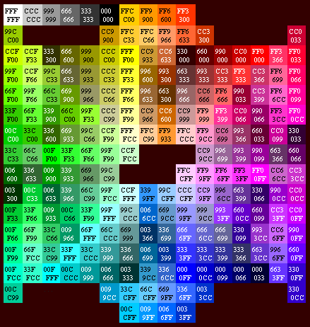

图像传感器将光线转化成电流，光线越亮，电流的数值就越大；光线越暗，电流的数值就越小。所以，如果用0到255的范围，表示光线的亮度，最亮的光线是白光，数值是十六进制的FF，最暗的光线是黑光（没有光），数值是十六进制的00。

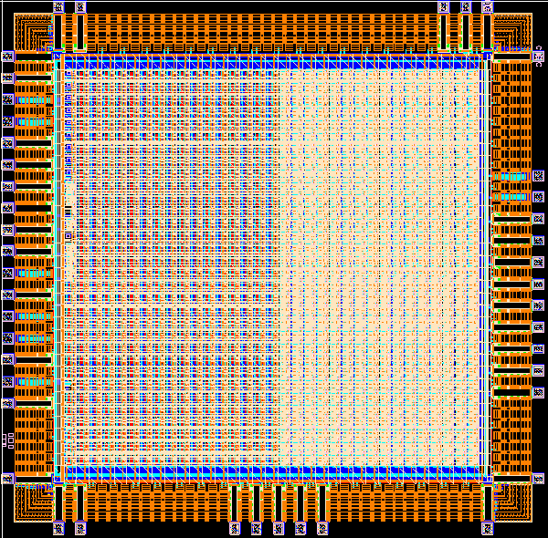

图像传感器的表面，分成若干个捕捉点，每个点都会产生一个数值，表示该点感受到的光线亮度，这就叫做"像素"。像素越多，图像细节就越丰富。如果一台相机的像素是1600x1200，就说明图像传感器横向有1600个捕捉点，纵向有1200个，合计192万个。

## 六、缺陷与解决方案

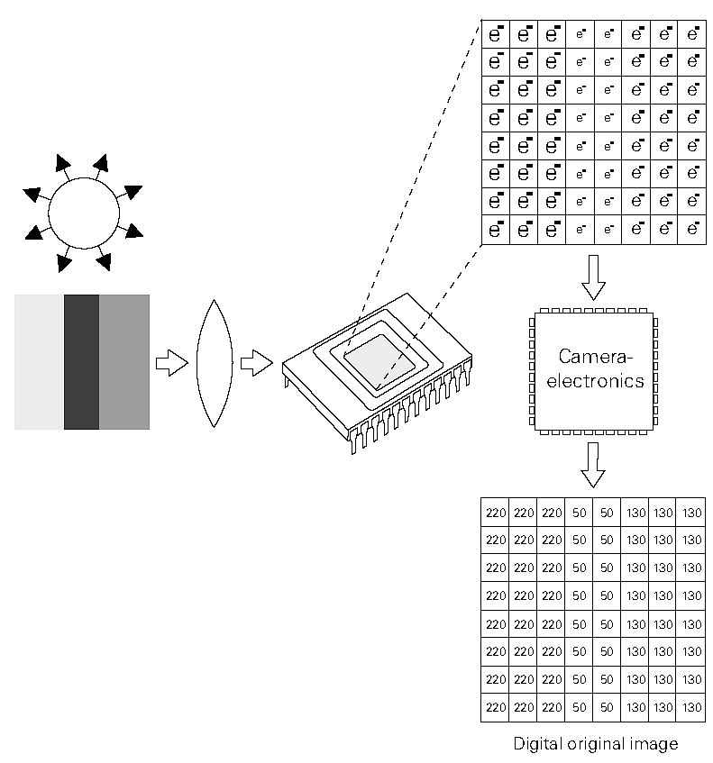

但是，图像传感器有一个很严重的缺陷：它只能感受光的强弱，无法感受光的波长。由于光的颜色由波长决定，所以图像传播器无法记录颜色，也就是说，它只能拍黑白照片，这肯定是不能接受的。

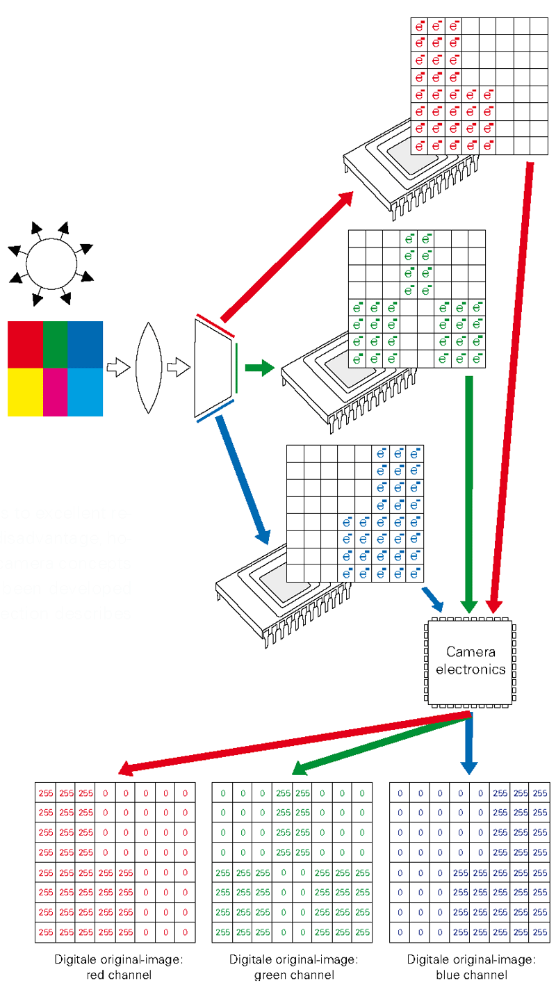

一种解决方案是照相机内置三个图像传感器，分别记录红、绿、蓝三种颜色，然后再将这三个值合并。这种方法能产生最准确的颜色信息，如果要采集RGB三个基本色，则需要三块滤镜，这样价格昂贵，且不好制造，因为三块滤镜都必须保证每一个像素点都对齐，所以这种方案就无法投入实用。

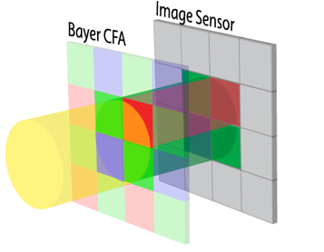

## 七、滤光层的出现

1974年，柯达公司的工程师布赖斯·拜尔提出了一个全新方案，只用一块图像传感器，就解决了颜色的识别。他的做法是在图像传感器前面，设置一个[滤光层](https://en.wikipedia.org/wiki/Color_filter_array)（Color filter array），上面布满了滤光点，与下层的像素一一对应。也就是说，如果传感器是1600x1200像素，那么它的上层就有1600x1200个滤光点。

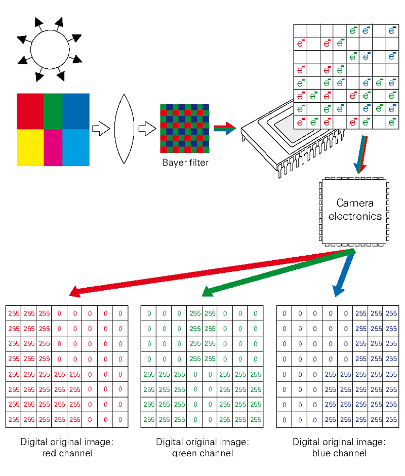

每个滤光点只能通过红、绿、蓝之中的一种颜色，这意味着在它下层的像素点只可能有四种颜色：红、绿、蓝、黑（表示没有任何光通过）。

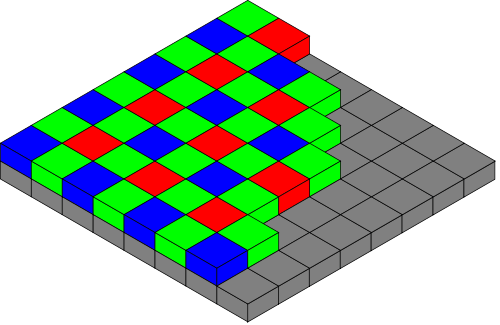

不同颜色的滤光点的排列是有规律的：每个绿点的四周，分布着2个红点、2个蓝点、4个绿点。这意味着，整体上，绿点的数量是其他两种颜色点的两倍。这是因为研究显示人眼对绿色最敏感，所以滤光层的绿点最多。

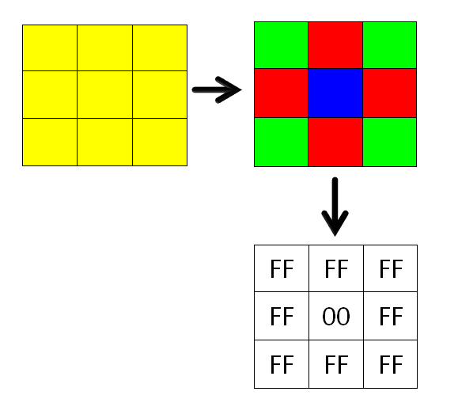

接下来的问题就是，如果一个像素只可能有四种颜色，那么怎么能拍出彩色照片呢？这就是布赖斯·拜尔聪明的地方，前面说了，每个滤光点周围有规律地分布其他颜色的滤光点，那么就有可能结合它们的值，判断出光线本来的颜色。以黄光为例，它由红光和绿光混合而成，那么通过滤光层以后，红点和绿点下面的像素都会有值，但是蓝点下面的像素没有值，因此看一个像素周围的颜色分布，有红色和绿色，但是没有蓝色，这样就可以推测出来这个像素点的本来颜色应该是黄色。

这种计算颜色的方法，就叫做["去马赛克"](https://en.wikipedia.org/wiki/Demosaicing)（demosaicing）。一般采用插值的方法进行色彩还原，经典的算法有：2x2邻域复制插值法、3x3邻域双线性插值法和5x5邻域高质量插值法。上图的下半部分是图像传感器生成的"马赛克"图像，所有的像素只有红、绿、蓝、黑四种颜色；上半部分是"去马赛克"后的效果，这是用算法处理的结果。

## 八、广泛应用

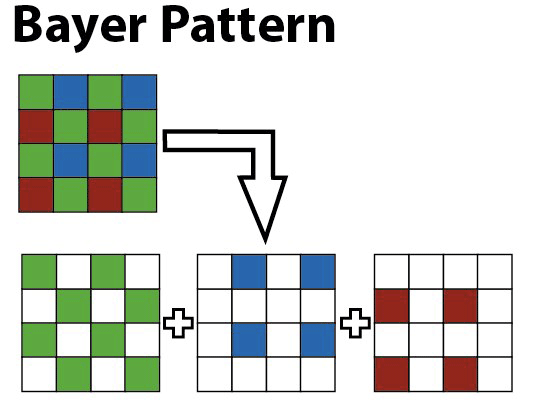

虽然，每个像素的颜色都是算出来的，并不是真正的值，但是由于计算的结果相当准确，因此这种做法得到广泛应用。目前，绝大部分的数码相机都采用它，来生成彩色数码照片。高级的数码相机，还提供未经算法处理的原始马赛克图像，这就是[raw格式](https://en.wikipedia.org/wiki/Raw_image_format)（raw image format）。为了纪念发明者布赖斯·拜尔，它被称作"拜尔模式"或["拜尔滤光法"](https://en.wikipedia.org/wiki/Bayer_filter) （Bayer filter）。

> 参考资料：
>
> [为什么数码相机可以拍出彩色照片？ - 阮一峰的网络日志](https://www.ruanyifeng.com/blog/2012/12/bayer_filter.html)
