<!-- more -->

## 一、格式简介

了解完照片的起源，再来看一看Bayer格式是什么，图片源自拜耳阵列，拜耳阵列是CCD或CMOS传感器拍摄彩色图像的主要技术之一。拜耳阵列是由伊士曼·柯达公司科学家Bryce Bayer发明的，被广泛运用数字图像。

Bayer格式是相机内部的原始图片，它是未经加工的，最原始的图像信息， 一般后缀名为.raw，有时候也会称这种格式为RAW 格式的，RAW全称是 RAW  Image Format，在编程中称之为原始。 RAW文件几乎是未经过处理而直接从CCD或CMOS上得到的信息。我们相机拍照下来存储在存储卡上的.jpeg或者其他格式的图片, 都是从.raw格式转化过来的。

raw格式的图片会有更多的画面细节和更加的画质表现，具有更高的动态范围。但是这种文件很大很大，一般的软件也无法打开。

> 动态范围：动态范围就是相机可以记录到的最亮和最暗范围。动态范围越大，表示相机越能将高反差的状况记录下来(即暗处有细节、亮处又不会过曝)；同理，动态范围越小，表示相机面对高反差时可能亮部和暗处的细节都会遗失(即暗处死黑、亮部又一片死白)。

> 7yuv：
>
> 7yuv 是一个用于**可视化**并编辑原始图像数据的工具。7yuv 能打开任何类型的文件，并将数据作为原始二进制进行处理。通过设定像素格式，7yuv 能查看并编辑 **Bayer**、RGB、YUV 等格式的图像文件。可以在官网下载：[Datahammer 7yuv YUV Viewer, Raw Graphics Editor & Hex Editor](http://datahammer.de/)

RGB三原色是组成彩色图片的基本要素。最简单的采集方法就是通过对应的透镜去采集，红色的滤镜透过红色的波长，绿色的滤镜透过绿色的波长，蓝色的滤镜透过蓝色的波长。但是这样成本很高，且不好制造，因为三块滤镜都必须保证每一个像素点都对齐。

bayer 格式图片在一块滤镜上设置的不同的颜色，通过分析人眼对颜色的感知发现，人眼对绿色比较敏感，所以一般bayer格式的图片绿色格式的像素是是r和g像素的和。也就是类似与现在的ISP的工作原理，通过算法对RGB的原色进行补充，然后得更好的原色图。下图为bayer色彩滤波阵列，由一半的G，1/4的R，1/4的B组成。

## 二、图像传感器

### 1. 简介

图像传感器是将光信号转换为电信号的设备，图像传感器通过捕捉光子并将其转化为电子信号，从而生成数字图像。它是数码相机、摄像机、智能手机、无人机、自动驾驶汽车以及各种工业和医疗应用的核心组件。 一般就长这个样子：

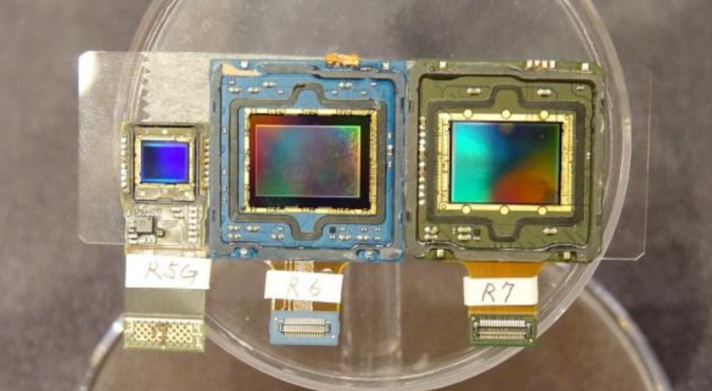

常见的图像传感器有CCD（Charge Coupled Device：电荷耦合元件）图像传感器， CMOS（Complementary Metal Oxide Semiconductor：互补金属氧化物半导体）图像传感器，3D ToF（Time of Flight，飞行时间）图像传感器和热敏图像传感器。

### 2. 基本结构

图像传感器的结构如下所示，每一个感光像素之间都有金属隔离层，光线通过显微镜头，在色彩滤波器过滤之后，投射到相应的漏洞式硅的感光元件上。 

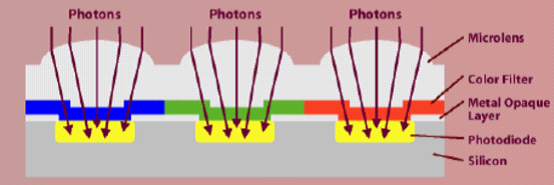

假设一个sensor的像素是8x分辨率为8x8），那么这个sensor就有8x8个感光点。当Image Sensor往外逐行输出数据时，像素的序列为`GRGRGR.../BGBGBG...`（顺序RGB）。这样阵列Sensor设计，使得RGB传感器减少到了全色传感器的1/3（三原色中绿色占比1/2 蓝色和红色分别为 1/4和1/4，整体就是采集的三原色是原本的1/3。），如下所示。

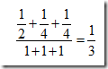

### 3. 不同的传感器

- ####  **CCD图像传感器**

CCD的结构就象一排排输送带上并排放满了小桶，光线就象雨滴撒入各个小桶，每个小桶就是一个像素。按下快门拍照的过程，就是按一定的顺序测量在一个短暂的时间间隔中，小桶中落进了多少“光滴”，然后逐个记录下来并放大为电信号。这个记录的过程式串行工作的，所以早期的CCD数码相机虽然成像质量好，但是集成度受限制，连拍速度没有CMOS传感器的数码相机快。

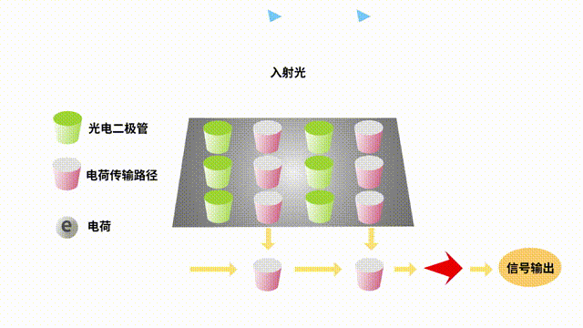

- #### **CMOS图像传感器**

CMOS图像传感器的各个光电二极管都配备有放大器，因此可即时放大电流并一次性转换传输出去。所以具有速度快，功耗低的特点，早期的CMOS图像传感器存在噪点多、感光度低,画质相对差的问题，但伴随技术发展，现在的CMOS传感器可以拍出超越CCD图像传感器的高画质视频与静止图像，在智能手机、数码相机等众多领域，CMOS图像传感器成为了主流。

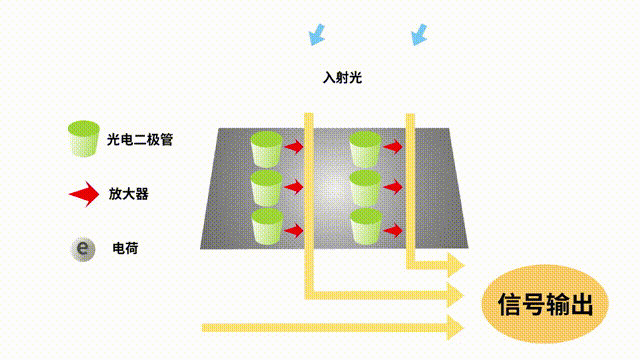

- #### **3D ToF图像传感器**

3D ToF图像传感器是一种基于测量光从传感器发射至目标物体到其返回的时间，从而构建三维图像数据的传感器。这种传感器通过计算光脉冲的飞行时间来确定物体与传感器之间的距离，从而生成三维点云数据。

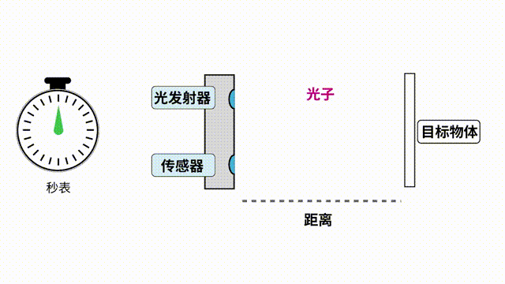

由于光速达到每秒约30万公里，如果直接测量光的反射时间，在进行细微的距离和图像检测的时候很难分辨出其飞行时间的差别。 所以一般来说ToF传感器会采用间接测量的方法，测量反射光相对于发射光的相位差来获取深度信息。传感器会发射调制过的红外光，并测量从不同距离的不同表面接收到的光的相位差。图中使用了两个接收检测器，第一个检测器的开关相位与发射光相同。会捕获一部分的反射光。而第二个检测接收器的开关相位与发射光相反，反射光也有另外一部分被其捕获，比较两个检测器捕获到的光子量的不同，就可以得到反射光相对于发射光的相位差，从而获得准确的距离信息。

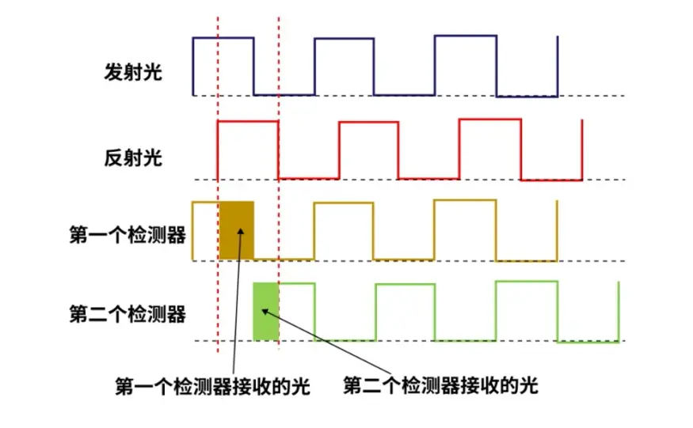

ToF 传感器可以与 RGB 图像结合， 用算法组合 RGB 和深度图像，从而获得包含颜色和深度的场景和观察对象的 3D 信息，这在一些智能应用场景中具有重要作用，例如对汽车内乘客手势的识别。下图中的深度信息以颜色来表示，颜色越靠近红色，表明距离摄像头越近，越靠近蓝色，表明距离越远。

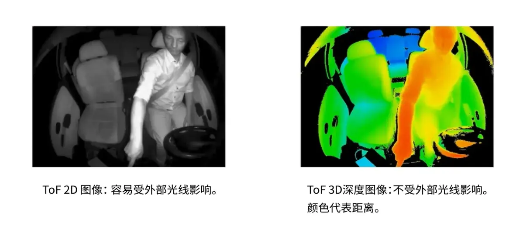

## 三、bayer格式算法实现

### 1. 四种bayer格式

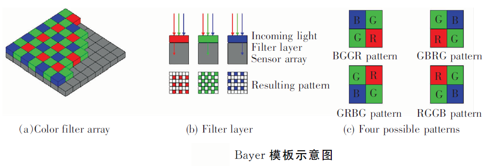

在Bayer颜色滤波阵列中，RGB三色的感光单元不是平均分布。基于人眼对绿色比较敏感，绿色（G）占50%，红色（R）和蓝色（B）各占25%。根据彩色滤波阵列的排列不同，Bayer彩色图像可分为BGGR、GBRG、GRBG和RGGB四种格式。

从bayer转换成rgb图的算法, RGB图, 即为三色图, 一个像素点就由RGB三种颜色构成的混合色, 而bayer图一个像素就只有一个颜色, 或R或G或B。因为bayer一个像素点只有一种颜色, 需要借助这个像素点周围的颜色对它进行插值(填充)另外的两种颜色, 它本身的颜色就不用插了。

### 2. 插值红蓝算法

每一个像素仅仅包括了光谱的一部分，必须通过插值来实现每个像素的RGB值。为了从Bayer格式得到每个像素的RGB格式，我们需要通过插值填补缺失的2个色彩。插值的方法有很多（包括领域、线性、3\*3等），速度与质量权衡，最好的是线性插值补偿算法。其中算法如下： 

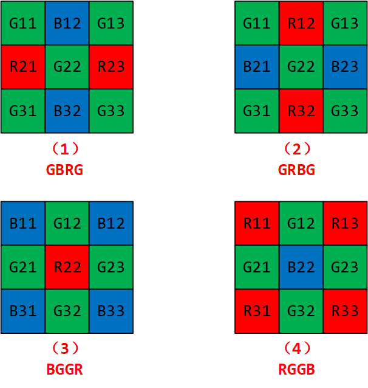

在（1）（2）中，我们知道了G元素，因此需要插值补全出R和B元素。中间像素的R跟B值分别取左右邻域（或上下邻域）的平均值。
$$
\begin{flalign} 
(1) :
R(G22)&=\frac{R21+R23}{2} \newline
G(G22)&=G22 \newline
B(G22)&=\frac{B12+B32}{2}
\end{flalign}
$$

$$
\begin{flalign} 
(2):R(G22)&=\frac{R12+R32}{2} \\
G(G22)&=G22 \\
B(G22)&=\frac{B21+B23}{2}
\end{flalign}
$$

在（3）和（4）中，中间本身就不存在G元素（不知道为啥，网上资料都这么写的，后续知道了再来补充），只存在B或者R元素，因此只需要插值补全R或者B元素。中间像素的B或R值取对角邻域的平均值。
$$
\begin{flalign} 
(3) :
R(R22)&=R22 \newline
B(R22)&=\frac{B11+B13+B31+B33}{4}
\end{flalign}
$$

$$
\begin{flalign} 
(4) :
R(B22)&=\frac{R11+R13+R31+R33}{4} \newline
B(B22)&=B22
\end{flalign}
$$

### 3. 插值绿算法实现

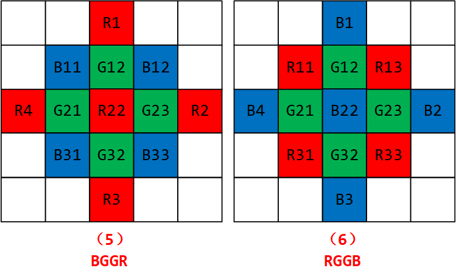

由于人眼对绿光反应最敏感，对紫光和红光则反应较弱，因此为了达到更好的画质，需要对G特殊处理。在上述（3）与（4）中，扩展开来就是上图的（5）与（6）中间像素G的取值，者也有一定的算法要求，不同的算法效果上会有差异。经过相关的研究，（5）和（6）其实就是之前的（3）和（4）中的G分量：
$$
(5):G(R22)=
\begin{cases}
\frac{G12+G32}{2} & |R1-R3|<|R2-R4| \newline
\frac{G32+G21}{2} & |R1-R3|>|R2-R4| \newline
\frac{G12+G21+G23+G32}{4} & |R1-R3|=|R2-R4|
\end{cases}
$$

$$
(6):G(B22)=
\begin{cases}
\frac{G12+G32}{2} & |B1-B3|<|B2-B4| \newline
\frac{G32+G21}{2} & |B1-B3|>|B2-B4| \newline
\frac{G12+G21+G23+G32}{4} & |B1-B3|=|B2-B4|
\end{cases}
$$

CMOS摄像头这部分转换是在内部用ADC或者ISP完成的，生产商为了降低成本必然会使得图像失真。当然用外部处理器来实现转换，如果处理器的速度足够快，能够胜任像素的操作，用上面的算法来进行转换，皆大欢喜。不过上述算法将直接成倍提高了算法的复杂度，速度上将会有所限制。因此为了速度的提成，可以直接通过来4领域G取均值来中间像素的G值，将会降低一倍的速率，而在性能上差之甚微，算法如下： 
$$
(5):G(R22)=\frac{G12+G21+G23+G32}{4}
$$

$$
(6):G(B22)=\frac{G12+G21+G23+G32}{4}
$$

如果能够通过损失图像的质量，来达到更快的速度，还可以取G1、G2的均值来实现，但是这样的做法会导致边沿以及跳变部分的失真。 

## 四、RAW的存储格式

raw图目前遇到的有2种存储格式，一种是经过压缩的MIPI raw，另一种是未经过压缩的unpacked raw，通常采集的raw图是10bit的，需要用2个字节来存储，两个字节有16个bit位，这样就有6个bit位为空。

- MIPI raw

MIPI raw就充分利用了这6个bit位，每5个字节存储4个像素值，如图下图所示：

每格代表两个bit位，前4个红色的格子存储的是第一个像素的高8位，接着4个黄色的格子存储的是第二个像素的高8位，接着4个绿色的格子存储的是第三个像素的高8位，接着4个蓝色的格子存储的第四个像素的高8位，接着1个蓝色的格子存储的是第4个像素的低2位，接着一个绿色的格子存储的是第3个像素的低2位，接着一个个黄色的格子存储的是第2个像素的低2位，最后一个红色的格子存储的是第1个像素的低2位。

- unpacked raw

unpacked raw的存储格式如下图所示，每个格子代表1个bit，绿色格子代表低10位被占用，白色格子表示高6位为空。

## 五、RAW格式的位数

常见的RAW格式位数有8、10、12位等：

- RAW8：用8bit表示G/R/G/B中的一个分量。

- RAW10：用10bit表示G/R/G/B中的一个分量，但是数据中是16bit，高6位没用，对应上面的unpacked raw的存储方式。

- RAW12：用12bit表示G/R/G/B中的一个分量，但是数据中是16bit，高4位没用。

这里要注意的是, bayer每个像素的值是8位的。但是有的相机的bayer格式却有10位, 12位以及14位, 16位的, 那么则需要将高于8位的数据转换为8位数据。 拿12位数据来说, 有的是取高8位或是低8位, 那么这样就会出现一个问题, 这张图像会有一个斜度, 不是偏亮就是偏暗, 或是出现其它颜色问题，需要后期进行校正。

> 参考资料：
>
> [RAW 图像查看工具 7yuv 的使用 - 大大通(简体站)](https://www.wpgdadatong.com.cn/blog/detail/41271)
>
> [图像传感器 - 从零开始认识各种传感器【二十六期】-CSDN博客](https://blog.csdn.net/m0_61036291/article/details/140924466)
>
> [图像bayer格式介绍以及bayer插值原理 - 知乎](https://zhuanlan.zhihu.com/p/72581663?from_voters_page=true)
>
> [raw图的存储格式和读取方式-CSDN博客](https://blog.csdn.net/qq_41320406/article/details/125989865)
