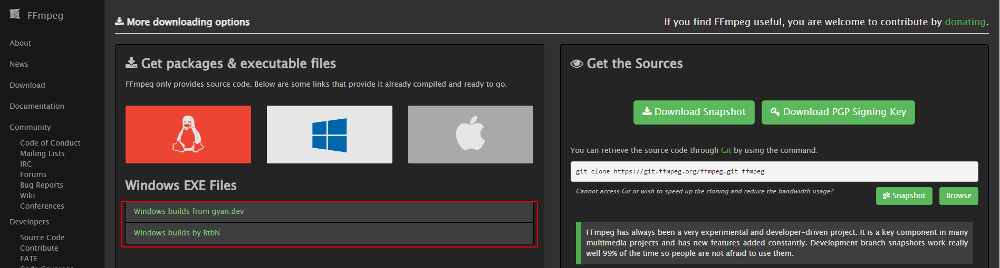
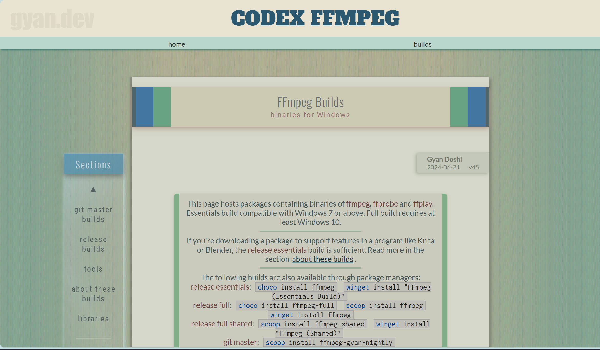
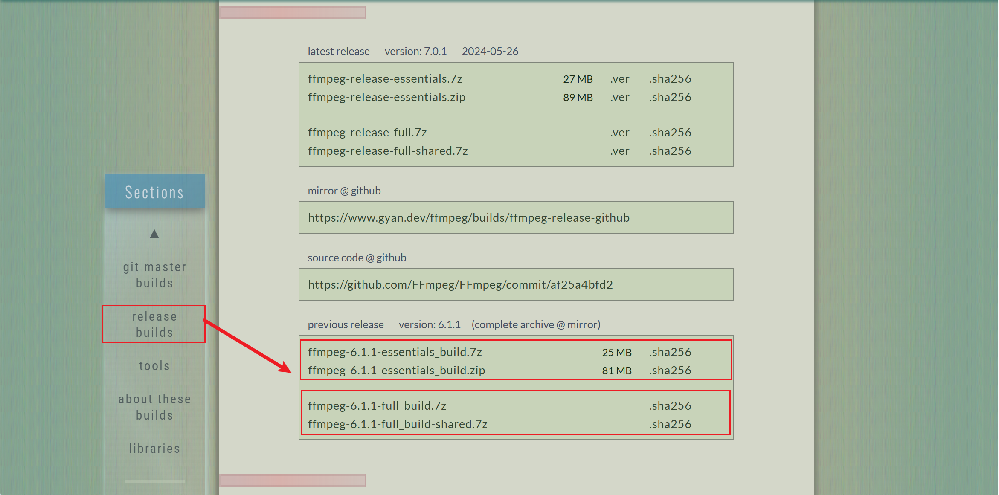
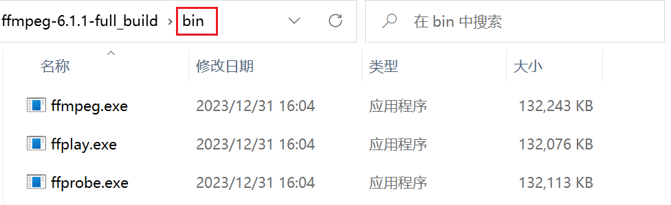
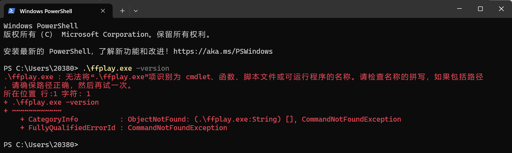
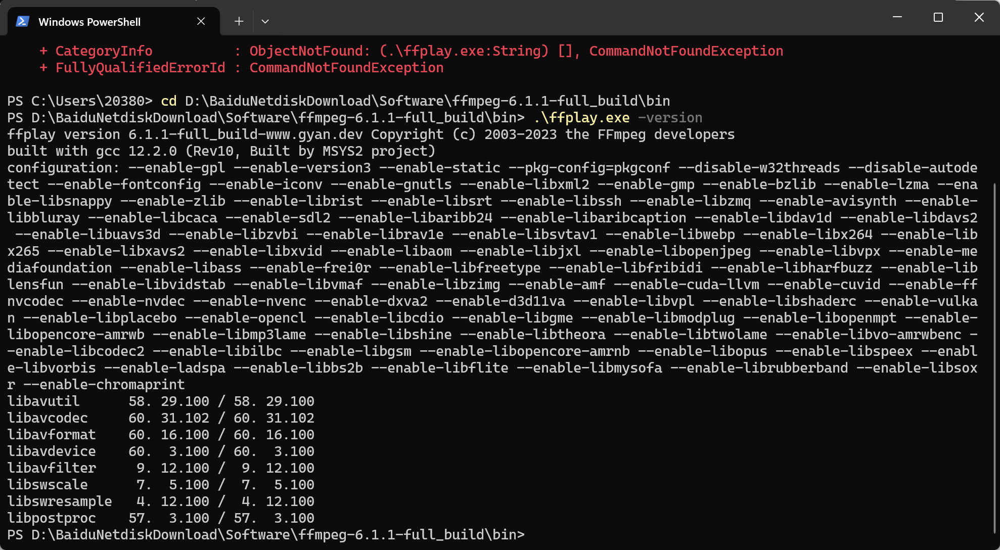
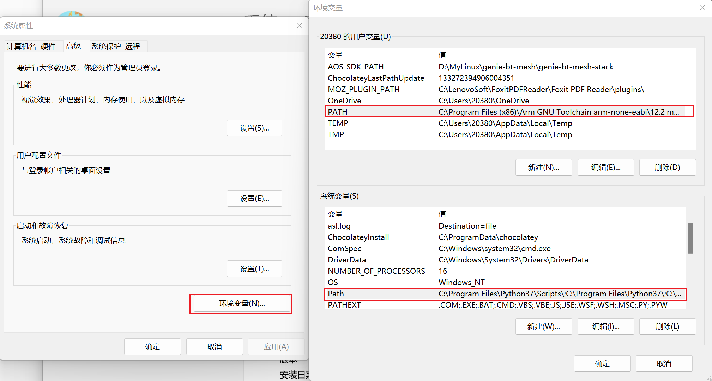
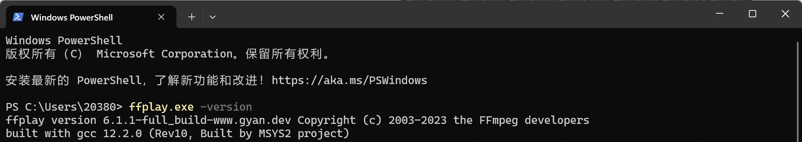

<!-- more -->


## 一、FFmpeg简介

FFmpeg 是一个可以处理音视频的软件，功能非常强大，主要包括，编解码转换，封装格式转换，滤镜特效。同时也支持 各种网络协议，支持 RTMP ，RTSP，HLS 等高层协议的推拉流，也支持更底层一点的TCP/UDP 协议推拉流。

在多平台系统方面，FFmpeg 的兼容性也优势显著，FFmpeg 可以在 windows，Linux，Mac，ios，android 等等操作系统上运行。

因此，可以说 FFmpeg 是音视频领域的瑞士军刀。在多个公司都有使用，例如 Google 的 chrome 里面就使用了 FFmpeg 的库。还有 Youtube，Facebook，以及国内的各种做音视频产品的公司。但是到我写这篇笔记开始学习的时候，FFmpeg 依然还是只有 命令行，没有GUI 图像界面，所以对使用者有一定的门槛。

FFmpeg 是一个开源项目，起始于2000年，截止 2022 年，已经走过 22 年，在这过程中，FFmpeg 社区经历过一次分裂。2011年的时候，一群 FFmpeg 开发者由于对项目管理者（不是Fabrice Bellard）不满，而另立山头，创建了 Libav 项目。Libav 项目经历了几年的发展，还是没有发展下去，最后 Libav 的成果代码，被合并到 FFmpeg 里面，git 提交记录保留了 Libav 开发者的名字。

> FFmpeg 跟 Libav 的渊源可以看这里：[Using libav* – FFmpeg](https://trac.ffmpeg.org/wiki/Using libav*)

## 二、下载与安装

### 1. 从哪里下载？

这个一般还是在windows下使用，所以后续的都暂时在window上进行，我们可以到官网找下载的地方：[Download FFmpeg](https://ffmpeg.org/download.html)，打开主链接就可以看到左下角的win图标：，点过去会发现有两个网址可以下载，我用的第一个gyn（[Builds - CODEX FFMPEG @ gyan.dev](https://www.gyan.dev/ffmpeg/builds/)）的。



打开第一个网址会来到这个地方：



我们点击这个release builds：



会发现有两种 压缩包，essentials_build 只有一些基本的库，full_build 是有全部的库。在这里 推荐下载 [ffmpeg-6.1.1-full_build.7z](https://www.gyan.dev/ffmpeg/builds/packages/ffmpeg-6.1.1-full_build.7z) ，学习 FFmpeg 的命令行使用，不需要 shared 动态库。

>带 shared 的压缩包里面，多了 include、lib 目录。把 FFmpeg 依赖的模块包单独的放在的 lib 目录中。ffmpeg.exe，ffplay.exe，ffprobe.exe 作为可执行文件的入口，文件体积很小，他们在运行的时候，如果需要，会到 lib 中调用相应的功能。
>
>不带 `shared` 的压缩包里面，`bin` 目录中有 `ffmpeg.exe`，`ffplay.exe`，`ffprobe.exe` 三个可执行文件，每个 `exe` 的体积都稍大一点，因为它已经把相关的需要用的模块包编译到`exe`里面去了。

下载完成后解压，我们会在bin目录下看到以下文件：



会发现FFmpeg 里面有 3 个软件：

- ffmpeg.exe ，功能强大的 处理音视频文件的软件。
- ffplay.exe，播放器，可以播放音视频文件。
- ffprobe.exe，查看音视频文件的属性，在调试排查问题的时候非常有用。

### 2. 环境变量配置

上面的三个其实是直接的可执行程序，根本不需要安装，由于这个FFmpeg没有图形界面，所以我们还是要再命令行或者其他终端来调用，这就意味着我们需要添加环境变量到电脑中，不然就会有以下问题（这里由于我使用的是Win11，它带了一个终端，其实用cmd命令行或者powershell也一模一样的）：



若是在刚才解压的目录的bin目录下执行，就正常：



所以这里我们需要添加环境变量，这样无论在哪个路径下就都可以调用了，我的是win11，所以就是【我的电脑】&rarr;【右键】&rarr;【高级系统设置】&rarr;【环境变量】：



然后把刚才解压的路径添加进去就可以了，添加完毕后随便开一个终端，还是输入以下命令：

```shell
ffplay.exe -version
```

有对应的版本打印信息说明添加成功。注意这个时候就不要加`.\`了，直接使用名称即可。


